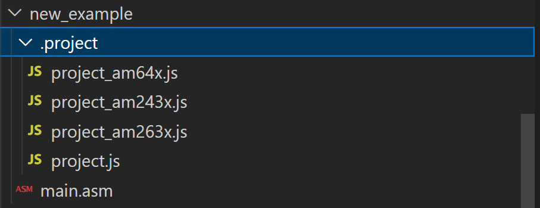

<div align="center">

<br/>
# OPEN PRU

[Introduction](#introduction) | [Features](#features) | [Getting Started](#getting-started) | [Building the examples](#building-the-examples) | [Information about using EVM boards](#information-about-using-evm-boards) | [Steps to add a new OPEN PRU project](#steps-to-add-a-new-open-pru-project) | [Contributing to the OPEN PRU project](#contributing-to-the-open-pru-project) | [Technical Support](#technical-support)

</div>

## Introduction

OPEN PRU is a software development package that enables development on the PRU processor core. PRU cores are included in Texas Instruments (TI) Sitara devices and Jacinto class of devices.

The OPEN PRU project currently supports these processors:

- AM243x: [AM2431](https://www.ti.com/product/AM2431), [AM2432](https://www.ti.com/product/AM2432), [AM2434](https://www.ti.com/product/AM2434)
- AM261x: [AM2612](https://www.ti.com/product/AM2612)
- AM263x: [AM2631](https://www.ti.com/product/AM2631), [AM2631-Q1](https://www.ti.com/product/AM2631-Q1), [AM2632](https://www.ti.com/product/AM2632), [AM2631-Q1](https://www.ti.com/product/AM2632-Q1), [AM2634](https://www.ti.com/product/AM2634), [AM2634-Q1](https://www.ti.com/product/AM2634-Q1)
- AM263px: [AM263P2-Q1](https://www.ti.com/product/AM263P2-Q1), [AM263P2](https://www.ti.com/product/AM263P2), [AM263P4-Q1](https://www.ti.com/product/AM263P4-Q1), [AM263P4](https://www.ti.com/product/AM263P4)
- AM64x: [AM6411](https://www.ti.com/product/AM6411), [AM6412](https://www.ti.com/product/AM6412), [AM6421](https://www.ti.com/product/AM6421), [AM6422](https://www.ti.com/product/AM6422), [AM6441](https://www.ti.com/product/AM6441), [AM6442](https://www.ti.com/product/AM6442).

For basic PRU development support on AM335x, AM437x, AM57x, and AM62x, refer to the [PRU Software Support Package (PSSP)](https://git.ti.com/cgit/pru-software-support-package/pru-software-support-package).

## Features

The OPEN PRU project provides:
  - [PRU Academy](./academy)
    - PRU Getting Started Labs (project creation, coding in assembly & C, compiling, loading PRU code, debugging PRU code)
    - Training labs (GPIO, interrupt controller, broadside accelerators, etc.)
  - [Application examples](./examples)
    - These PRU examples can be used as a foundation for your design: I2S, SPI, I2C, ADC, etc.
  - [Helpful software tools](./source)
    - firmware macros
    - register definitions
    - example drivers

## Getting Started

Please follow the [Getting started steps](./getting_started.md) to install dependencies and properly set up the OPEN PRU repository.

## Building the examples 

**NOTES**
- Use `gmake` in Windows, and `make` in Linux. gmake is present in CCS. Add the path to the CCS gmake at `C:\ti\ccsxxxx\ccs\utils\bin` to your windows PATH.
- Unless mentioned otherwise, all `make` commands are invoked from the root folder of the `open-pru` repository.
   ```bash
   cd open-pru/
   ```
- Current supported device names are am243x, am261x, am263x, am263px, am64x
- Pass one of these values for `"DEVICE="`
- You can also build components (examples, tests or libraries) in the `release` or `debug`
  profiles. To do this pass one of these values for `"PROFILE="`

### Basic Building With Makefiles

#### Build a single project

Make sure to build the PRU firmware before building the associated RTOS / bare metal code. For example,
to build an AM243x PRU firmware example for the "empty" project, run the following:
   ```bash
	make -s -C examples/empty/firmware/am243x-lp/icss_g0_pru0_fw/ti-pru-cgt     all 
	make -s -C examples/empty/firmware/am243x-lp/icss_g0_pru1_fw/ti-pru-cgt     all 
	make -s -C examples/empty/firmware/am243x-lp/icss_g0_rtu_pru0_fw/ti-pru-cgt all
	make -s -C examples/empty/firmware/am243x-lp/icss_g0_rtu_pru1_fw/ti-pru-cgt all
	make -s -C examples/empty/firmware/am243x-lp/icss_g0_tx_pru0_fw/ti-pru-cgt  all
	make -s -C examples/empty/firmware/am243x-lp/icss_g0_tx_pru1_fw/ti-pru-cgt  all
   ```
Once the PRU Firmware build is complete, the PRU firmware header files are moved to a location included in the R5F default include path. The PRU firmware will get bundled into the R5F output binary.
   
To build the R5F example, run:
   ```bash
   make -s -C examples/empty/am243x-lp/r5fss0-0_freertos/ti-arm-clang all PROFILE=debug
   ```

#### Build all projects

Run these commands to build **all projects** in the OPEN PRU repo. Valid PROFILE options are "release" or "debug":

   ```bash
   make -s -j4 clean DEVICE=am243x PROFILE=debug
   make -s -j4 all   DEVICE=am243x PROFILE=debug
   ```

### Basic Building With CCS

- **When using CCS projects to build**, import the CCS project from the above mentioned Example folder path for R5F and PRU. After this `main.asm`, `linker.cmd` files get copied to ccs workspace of PRU project.

- Build the PRU project using the CCS project menu. Refer to **the MCU+ SDK documentation > Using SDK with CCS Projects**:
  - [AM64x](https://software-dl.ti.com/mcu-plus-sdk/esd/AM64X/latest/exports/docs/api_guide_am64x/CCS_PROJECTS_PAGE.html)
  - [AM243x](https://software-dl.ti.com/mcu-plus-sdk/esd/AM243X/latest/exports/docs/api_guide_am243x/CCS_PROJECTS_PAGE.html)
  - [AM261x](https://software-dl.ti.com/mcu-plus-sdk/esd/AM261X/latest/exports/docs/api_guide_am261x/CCS_PROJECTS_PAGE.html)
  - [AM263Px](https://software-dl.ti.com/mcu-plus-sdk/esd/AM263PX/latest/exports/docs/api_guide_am263px/CCS_PROJECTS_PAGE.html)
  - [AM263x](https://software-dl.ti.com/mcu-plus-sdk/esd/AM263X/latest/exports/docs/api_guide_am263x/CCS_PROJECTS_PAGE.html)

#### Build the PRU firmware

- Once you click on **build** in the PRU project, the PRU firmware header file is generated in the CCS release or debug folder. The PRU header file is moved to  `<open-pru/examples/pru_io/empty/firmware/device/>`

#### Build the R5F firmware

- Build the R5F project using the CCS project menu. For more details, refer to **the MCU+ SDK documentation > Using SDK with CCS Projects** linked above.

- The PRU Firmware header file path is included in the R5F project include options by default.

- Build Flow: Once you click on build in the R5F project, SysConfig files are generated. Then the R5F project will be generated using both the generated SysConfig files, and PRU project binaries.

## Information about using EVM boards

For more details on EVM Board usage, please refer to the Getting started section of MCU+ SDK README_FIRST_*.html page. The MCU+ SDK User guides contain information on
  
- EVM setup
- CCS Setup, loading and running examples
- Flashing the EVM
- SBL, ROV and much more.

Getting started guides of MCU+ SDK are specific to a particular device. The links for all the supported devices are given below

- [AM243x Getting Started Guide](https://software-dl.ti.com/mcu-plus-sdk/esd/AM243X/latest/exports/docs/api_guide_am243x/GETTING_STARTED.html)
- [AM64x  Getting Started Guide](https://software-dl.ti.com/mcu-plus-sdk/esd/AM64X/latest/exports/docs/api_guide_am64x/GETTING_STARTED.html)
- [AM261x Getting Started Guide](https://software-dl.ti.com/mcu-plus-sdk/esd/AM261X/latest/exports/docs/api_guide_am261x/GETTING_STARTED.html)
- [AM263Px Getting Started Guide](https://software-dl.ti.com/mcu-plus-sdk/esd/AM263PX/latest/exports/docs/api_guide_am263px/GETTING_STARTED.html)
- [AM263x Getting Started Guide](https://software-dl.ti.com/mcu-plus-sdk/esd/AM263X/latest/exports/docs/api_guide_am263x/GETTING_STARTED.html)

## Steps to add a new OPEN PRU project

### Step 1 : create .project folder inside new_example folder 

This folder contains the following files:

- project.js : Gets the component properties and component build properties from project_{device}.js file. There should only be one project.js file inside .project folder
- project_{device.js} : Different custom build properties, compiler flags, linker flags etc. depending on the device can be specified in this file. These files can be created for different devices, for example, project_am64x.js , project_am243x.js, project_am261x.js, project_am263px.js, project_am263x.js etc.

Note : project.js file can be used from empty example without any modifications and initial version of project_{device}.js can be copied from empty example and can be modified as per requirements, when new R5F project to be created use project_{device.js} from examples/empty/.project/project_{device.js} and when new PRU project to be created use project_{device.js} from examples/empty/firmware/.project/project_{device.js}

In general, the .project folder inside the new example should look similar to below image

<br/>

### Step 2 : Modify the contents of the project_{device}.js

This file uses 2 functions: getComponentProperty() and getComponentBuildProperty() where user can provide different values as per their requirements to build a PRU project of our choice, some of which are discussed as follows.

- Change the name of the project by modifying the value project_name
   - An example is given below
      ```
      let project_name = "new_example";
      ```
- Add a description for the project by modifying the value property.description . 
   - An example is given below
      ```
      property.description = "new example PRU Project";
      ```
- Provide the different build option combos, by modifying the value of property.buildOptionCombos. It takes in an array of JavaScript objects wherein one can specify the device, cpu, cgt, board and os. An example array of build option combos is given below.
   ```
   const buildOptionCombos = [
      { device: device, cpu: "icssg0-pru0", cgt: "ti-pru-cgt", board: "am243x-evm", os: "fw"},
      { device: device, cpu: "icssg0-pru0", cgt: "ti-pru-cgt", board: "am243x-lp", os: "fw"},
   ];
   ```
- Default PRU post build steps and custom PRU post build steps can be added as below
   - In case of default Post Build steps, just assign the value true to property.defaultPruPostBuildSteps. 
   - In case of custom Post Build steps, create a JavaScript array with the steps and assign it to property.postBuildSteps. An example array of Post Build steps is given below. 
   ```
   let postBuildSteps = [
      "$(CGT_TI_PRU_PATH)/bin/hexpru --diag_wrap=off --array --array:name_prefix=PRUFirmware  -o new_example.h new_example_{board}_{cpu}_{os}_{cgt}.out"
   ];
   - Note : {board}, {cpu}, {os}, {cgt} from build options is added to property.name then project and .out is created with new_example_{board}_{cpu}_{os}_{cgt} name
   ```
- Compiler includes while building the project can be specified using build_property.includes. An example of a custom includes object is given below.
   ```
   const includes = {
      common: [
         "${MCU_PLUS_SDK_PATH}/source/pru_io/firmware/common",
         "${OPEN_PRU_PATH}/source"
      ],
   };
   ```
- Custom defines while building the project can be specified using build_property.defines in getComponentBuildProperty function. An example of a custom defines object is given below
   ```
   const defines = {
      common: [
         "NEW_EXAMPLE"
      ],
   };
   ```
- Custom compiler flags and linker flags can be specified using build_property.cflags and build_property.cflags respectively in getComponentBuildProperty function. An example of custom compiler flags and linker flags objects are given below
   ```
   const cflags = {
      common: [
         "-v4"
      ],
   };
   
   const lflags = {
      common: [
         "--entry_point=main",
      ],
   };
   ```
### Step 3 : Add the path of the project.js file to the respective device's examples file list

The path to the project.js of the new project needs to be added to the example file list of the required device. Go to open_pru/.project/device/project_{device}.js and add the path to the project.js of the new example to the example_file_list array.

- For example, if one is using AM243x, go to  open_pru/.project/device/project_am243x.js and add examples/new_example/.project/project.js to the example_file_list array. In general, it should look similar below image.

<br/>

### Step 4 : Generate build files

- Run one of the below command from the root folder of open-pru

#### Option 1: Prebuilt MCU PLUS SDK installers for specific devices are used
   ```bash
   make gen-buildfiles DEVICE={device} 
   ```
   - For example, if the new example is created am243x run below command
      ```bash
      make gen-buildfiles DEVICE=am243x
      ```

#### Option 2: MCU+ SDK repository which is core for all the Sitara MCU and MPU devices is used
   ```bash
   make gen-buildfiles DEVICE={device} GEN_BUILDFILES_TARGET=development
   ```
   - For example, if the new example is created am243x run below command
      ```bash
      make gen-buildfiles DEVICE=am243x GEN_BUILDFILES_TARGET=development
      ```

### Step 5 : Link or Copy source files to ccs workspace
- In order to link source files to workspace add below in getComponentBuildProperty
   ```bash
   build_property.projecspecFileAction = "link"
   ```
- In order to copy source files to workspace use below in getComponentBuildProperty
   ```bash
   build_property.projecspecFileAction = "copy"
   ```

### Step 6:  Import to CCS
   - After step4, example.projectspec, makefile and the files mentioned in build_property.templates get generated
   - Now one can simply import the project by browsing to that folder in CCS, then build and test it.

## Contributing to the OPEN PRU project

We hope to start accepting contributions to the OPEN PRU project sometime soon. Reach out to us on [TI's E2E forums](https://e2e.ti.com/) for updates!

## Technical Support

Reach out to us with questions on [TI's E2E forums](https://e2e.ti.com/). Please note that support may be limited for OPEN PRU projects in the examples/ folder.