<div align="center">

# FFT on PRU

[Introduction](#introduction) | [Overview](#Overview) | [Instructions](#Instructions) | [Results](#Results) | [Utilities](#utilities) | [Algorithm](#Algorithm)  
</div>

## Introduction
The code performs a real valued 4096-point Fast-Fourier Transform on 4096 discrete input samples in the ICSS Shared Memory. The specific implementation makes use of a Real-valued DIT Split-Radix algorithm and runs on ICSSG PRU0.  

## Overview
The algorithm assumes input samples in Q24 format to be present in the configured memory space. The current implementation assumes unsigned inputs which are common for ADC measurement values. 

The function that performs the FFT gets executed once in the provided implementation, which could also be configured to be repeatedly triggered by a particular event (for example, when input samples are ready). There is a window function(hanning window by default) applied to the input samples in the beginning, which can be configured to be a different window function if needed by changing the loaded LUT. 

After execution, the output samples, in frequency domain, will be present in specified shared memory location in the following order : $${Re(0), Re(1),.., Re(N/2), Im((N/2)-1),.., Im(1)}$$ 

## Instructions 

1. Get the 'fft' folder from the repository which contains the project, data and utility scripts.  
2. Import the project 'split_radix_fft_4k_single_core' inside the 'fft' folder into the CCS workspace. 
3. Build the Project. 
4. Launch Target Configuration and connect to core ICSS_G0_PRU_0.
5. Edit the 'load_memory.js' file in the 'utilities' folder and set the variable 'DatPath' as the path to the 'data' folder inside 'fft':
    ```
    var DatPath = "<add_your_data_folder_path_here>"; //data location
    ```
6. Open Scripting Console in CCS(View -> Scripting Console)

7. Run the load_memory.js using the following command to load the sample inputs and look-up tables(LUTs) into ICSSG shared memory (replace "\<add_your_js_file_path_here\>" with the absolute address to 'utilities'):
    ```

    loadJSFile "<add_your_js_file_path_here>//utilities//load_memory.js"

    ```
    Now the following data are loaded into the mentioned locations in memory:

        1. sample_input_4k.dat
            (The sample input dat file contains 4096 discrete samples of a sinusoidal wave that is offsetted to make all values positive) 
            Shared Mem : 0x10000 - 0x13FFC 
        2. hanning_window_q32_4K_halved.dat
            Shared Mem : 0x18000 - 0x19FFC
        3. twiddle_factor_lut_4k.dat
            Shared Mem : 0x1A000 - 0x1DF4C
        4. bit_reversed_values_9bit.dat
            Shared Mem : 0x1E000 - 0x1E3FC
    To perform FFT on input sample sets other than the provided samples, replace the values in input memory range (0x10000 - 0x13FFC) with the new inputs in Q24 format and continue. Current implementationn supports only positive inputs, as is the case with common ADC outputs.

8. Load the binary(.out file) to the connected core and run. 
9. After successful execution, the output can be found starting at the address 'OP_RAM_ADDR_BASE' (0x14000 to 0x17FFC)of the shared memory.The output is present in memory in the following format:
    ```
    | Re(0) | Re(1) |.. | Re(N/2) | Im((N/2)-1) |..| Im(1) |
    ```
    where Re(x) and Im(x) are the real and imaginary part of the 'x'th complex fft output.


### Post Processing
The output values can be exported and processed to extract FFT Magnitude and Phase information. As an example of how fft magnitude information can be extracted from this output, we have included another example in the fft folder that calculates the magnitude information from fft output. 

To run the post processing code , follow these steps:
1. Import the 'split_radix_fft_post_processing' project into CCS.
2. Build the project and to generate '.out' file
3. Execute the split-radix fft program by following the steps in the previous section. The output will now be present in shared memory ( default location : 0x14000 to 0x17FFC)
4. Load the '.out' file into the same ICSS_G0_PRU_0 core and run. 
5. After successful execution, the fft magnitude values will be present in the location 'FFT_MAG_MEM'(0x10000 by default, rewriting half of the input values). 

The magnitude information ranges from X[0] to X[N/2]. X[0] is the DC offset and X[N/2] represents the nyquist frequency. 

To visualize the magnitude values, use the CCS inbuilt plot:
1. Connect to an ARM core (eg. MAIN_Cortex_R5_0_0)
2. Open CCS Single-time Graph plot (Tools -> Graph -> Single Time). Use the following settings (note that global address is used since connection is from ARM core):

<figure>
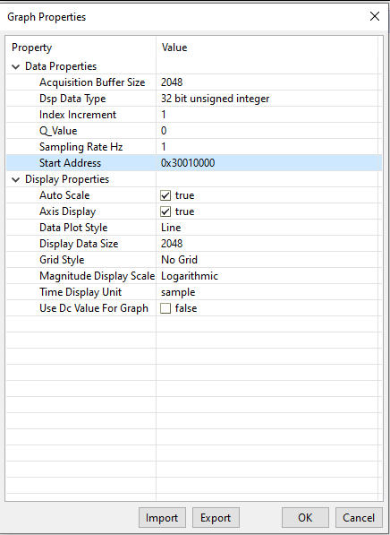
<figcaption>Fig.1 : CCS settings for fft magnitude plot</figcaption>
</figure>

The FFT Magnitude plot is obtained for the sample input as shown in the below figure:
<figure>
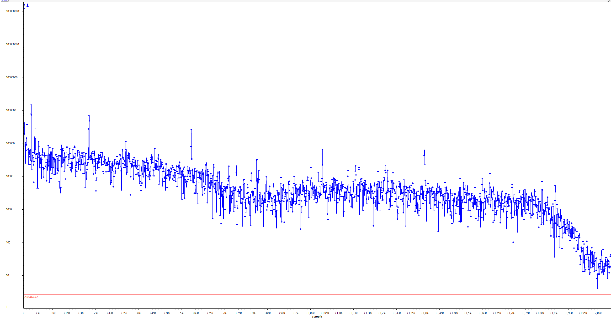
<figcaption>Fig.2 : FFT Magnitude plot</figcaption>
</figure>


NB : The execution of post processing program rewrites the input samples we loaded using the java-script. Before running fft again, make sure to run the java-script again to reload the input values.

## Results

Sample 4096-sample input data: 

<figure>
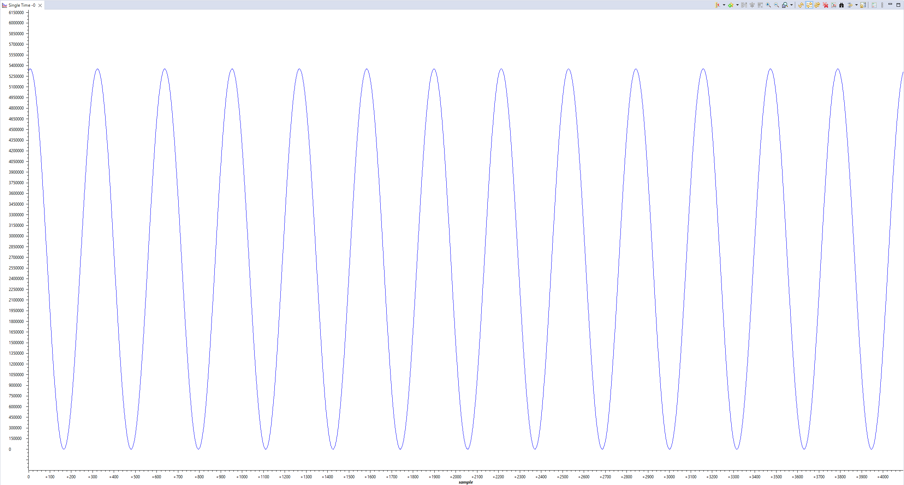
<figcaption>Fig.3 : Sample Discrete 4096 sample Input</figcaption>
</figure>

We can perform an FFT Magnitude plot of the sample input using CCS in-built 'fft magnitude plot' feature, and compare it with the magnitude plot by PRU to verify the correctness of the implementation:

<figure>

<figcaption>Fig.4 : FFT plot comparison </figcaption>
</figure>

To compare the accuracy of the calculations, the CCS values were exported and the SNR of the magnitude plot for both CCS calculated and PRU calculated magnitude values were calculated. The SNR or Signal to Noise Ratio is given by : 
$$ SNR = 10 * log (Signal Power/Noise Power)   $$

The signal power and noise power of both magnitudes and claculated SNR is compared in the following table:

| Parameters     | CCS     | PRU      |
|----------------|:-------:|:-----------:|
| Signal Power   |  3061274421813930000 | 3061275398618600000 |
| Noise Power    |  336718356992        | 336610682368        |
| SNR            | 69.5864 |  69.5877 |

The SNR value for the results from our implementation is seen to be very close to expected values calculated from CCS-generated values.

A closer zoomed analysis reveals the peaks to be near 0th and 13th frequency bins which corresponds to the 0Hz (DC offset) and 50Hz(Frequency of the input sample data):
<figure>
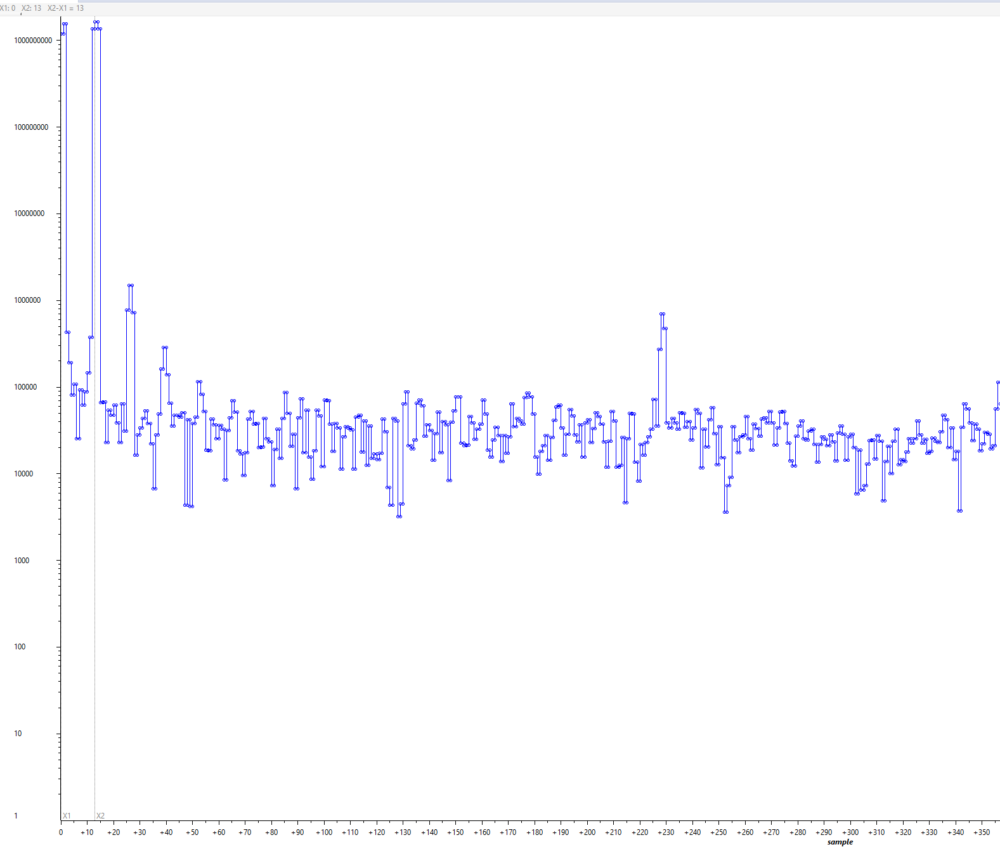
<figcaption>Fig.5 :FFT Magnitude plot - Zoomed in</figcaption>
</figure>


The FFT execution timings are as follows:

Algorithm : 4096-point Real-valued DIT Split-Radix algorithm 
| FFT stage         | # Cycles | Execution time on PRU @333Mhz |
|--------------|:-----:|:-----------:|
| Window Function           |  42677 |  0.128 ms       |
| fft core algo     |  426485 |    1.28 ms       |
| Complete execution (excluding initializations) |  469239 |  1.41 ms |

Following are the Resource Usage:
| Memory ||
|--------------|:-----:|
| Instruction Memory           |  1832 Bytes |       
| Shared Memory     |  58184 Bytes |         

| Broadside Accelerators ||
|--------------|:-----:|
| PRU_ICSSG Filter Data Base (as Broadside RAM) |16 KB|
| PRU_ICSSG Scratch Pad Memory |Bank 0, Bank 2|
| PRU Multiplier ||
| PRU_ICSSG XFR2VBUS Hardware Accelerator ||


 
## Utilities
### LUT generation
Python scripts are used to generate the LUTs used in the current implementation. The scripts included are the following:
1. Hanning_window_Q32_rounded_LUT_Generator.py  
    Window Coefficient Generator (Hanning window Coefficients in Q32 format generated in the provided script). To use a different window, generate the corresponding LUT by making necessary changes in the script.  
2. BOR_9bit_LUT_Generator.py
    Bit-order reversed index Generator

The twiddle factor LUT is generated by using the reference C code  ([rsplitfft.c](https://github.com/dave18/Pandora-Star/blob/master/rsplitfft.c)). This code is also included:

3. twiddle_factor_LUT_generator.c
### LUT quick load
A simple java script to load all the default pre-generated LUTs into the memory:
1. load_memory.js

To load custom inputs into memory using the javascript, modify the path to sample inputs in java script to the new location and update the file name.

## Algorithm 
The algorithm first applies a window function to the input samples. The samples are sorted in a bit-order reversed index permutation before applying multiple butterfly functions over multiple stages as part of the main split-radix algorithm. These steps are explained in the following sections. 

### Window Function and Bit-order Reversed sorting

The window function helps to attain a better final frequency distribution. The FFT algorithms, by nature,  assumes that the input data set that we are working on is a finite one, that represents one period of the continuous signal. This means the end points of the input sample set are assumed to be continuous. The signals could be sampled coherently, which means the samples collectively contain an integer number of periods in it and which by default should mean the end points are continuous. However, the more common case is that the signal is sampled non-coherently and there is an abrupt transition between end-points. This artificial discontinuity shows up in the final FFT spectrum and widens the spectral lines of different frequencies more than what it is, leading to what is known as Spectral Leakage. To minimize spectral leakage for non-coherent samples, we apply a window function over the input samples which smoothens out the end-point signal amplitudes and minimizes the effect of spectral leakage.

Further reading : [Window functions](https://en.wikipedia.org/wiki/Window_function)

The FFT is performed on a fixed number of discrete input signal samples. This implementation performs a '4K FFT', which processes 4096 samples (2^12) at a time. To improve the accuracy of the transformation, we apply a 4K window in the beginning of the algorithm. A window function is a symmetric function which can be applied either in the time or frequency domain. We are applying the window function in time-domain by basically doing a point-wise multiplication of the input function with a window function. Each point in a window function could be called seen as a window coefficient that is to be multiplied with corresponding input data sample. For an input sample $X(i)$ and a window coefficient $W(i)$ , the windowed input sample $X_W$ is given by :
$\ X_W(i) = X(i) * W(i) $

The window coefficients are stored as a Look-up Table (LUT) in the shared memory of ICSSG. Since the window function is symmetric, only half of the window coefficients need to be stored. Each coefficient is then multiplied by two input sample values from either side To be more specific, $W(i)$ is multiplied by $X(i)$ and $X(N-i)$, where N is the window length, that is 4096 in this case.

<figure>

<figcaption>Fig.6 Application of Window coefficients</figcaption>
</figure>

The window coefficients are loaded into the shared memory, from where we make use of xfer2vbus data accelerator for loading 8 window coefficients together into the registers. The accelerator works by pre-loading a certain number of window coefficients into an XFR2VBUS RX buffer, from where the broadside connection enables us to load these values to the registers in a single cycle. Before the first set of coefficients are loaded, there is a wait involved to make sure all window coefficients are loaded into the buffer. Auto read mode is enabled such that everytime the coefficients are read from the buffer, the transfer of next set of window coefficients is initiated. This transfer happens in the background while we perform operations using the already loaded coefficients and by the time the next set is needed, it can be loaded into the registers in a single cycle, without any wait time involved. 

The 8 loaded window coefficients have to be multiplied with 16 input values as described earlier. Due to register space limitation, half of these values are moved to the scratchpad after they are loaded. For multiplication, first the window coefficient is moved to one of the multiplication operand registers. The first input to be multiplied with this coefficient is moved to the second operand register ad multiplication is performed. Later, the second input which is present in scratchpad is moved similarly  to obtain the second required product. The obtained product has to be stored in a different index to perform bit-order reversed sorting of the inputs which is discussed in the 
next section. The algorithm can be visualized in the combined image showing both steps below. 

#### Bit-order reversed index calculation
To perform a DIT FFT, the inputs have to be sorted in a special order. This sorting puts every data sample belonging to index 'i' at an index 'j' , where 'j' can be obtained by reversing the order of bits in 'i'. This sorting is combined with the windowing step such that, after the window coeffficient is applied to an input, it is stored in a new index corresponding to the bit-order reversal sorting. Due to this out-of-order storing, a second memory space within the shared memory is allocated for the output of the windowing+bt-order reversal sort algorithm. The FFT algorithm that comes later actually happens in-place, so this memory is also the output memory for the complete algorithm.

To calculate the bit-order-reversed index for every index, we use a partial Look up Table based approach. For 4K FFT, the bit order reversal is performed with respect to 12 bits. For example index 2036 is bit-order reversed as follows: 
$$ 2036 => 0b011111110100 --(BOR)--> 0b001011111110 => 766 $$ 
The 8 contiguous input values idexes for which bit order reversal has to be performed, have the first 9 bits in common. This also means the last 9 bits are the same for their bit-order reversed values. These 9 bit values are stored in an LUT and loaded for every input set in the beginning of every window application cycle. The final 3 bits have to be appended in the beginning, which are 8 different constant values and can be coded into the instruction itself. For the second set of inputs, the 9 bit base value can be obtained by doing a 9-bit 1's complement to the first 9 bit value. This is because for each value X[i] we load as first input set, the second input set contains X[N-i] and (N-i) conveniently turns out to be the 1's complement of i. From this relation it follows that the bit-order reversed values of these numbers are also 1's complements to each other. A different set of 8 constants are to be prefixed to these base values and the second set of inputs, after windowing, are stored to these new calculated indexes. This algorithm, that calculates bit-order reversed values for index_1 and index_2 that are complements to each other, is illustrated in the figure below:


<figure>
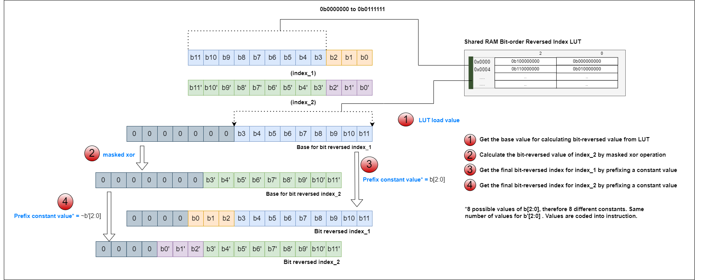
<figcaption>Fig.7 4K bit-reversal index calculation</figcaption>
</figure>

The overall algorithm for windowing and bit-reversal can be summarized as shown in the following diagram :

<figure>
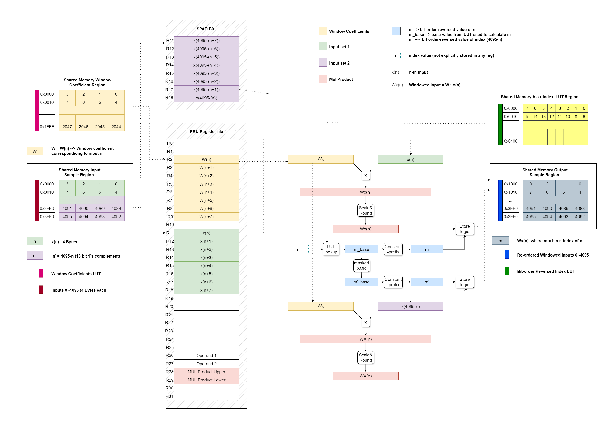
<figcaption>Fig.8 Windowing plus bit-order-reversal</figcaption>
</figure>


### Split-radix FFT algorithm

The fundamental operation behind an FFT algorithm is the repeated application of special structures called butterflies. The split-radix FFT makes use of an L-shaped butterfly, that is a combination of a radix-2 butterfly and a radix-4 butterfly. The L-shaped butterfly is shown in the following figure:

<figure>
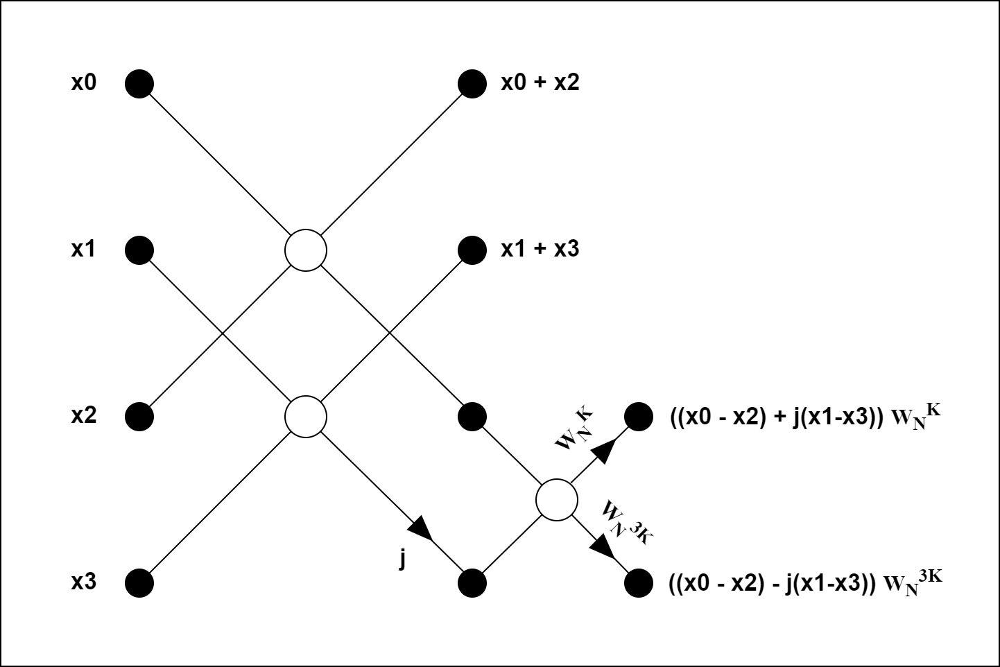
<figcaption>Fig.9 l-shaped Butterfly</figcaption>
</figure>

An in-place computation of this algorithm follows repeated application of the L-shaped butterfly over multiple stages. The figure shows an example 32-point Decimation-In-Frequency(DIF) split-radix FFT. 

<figure>
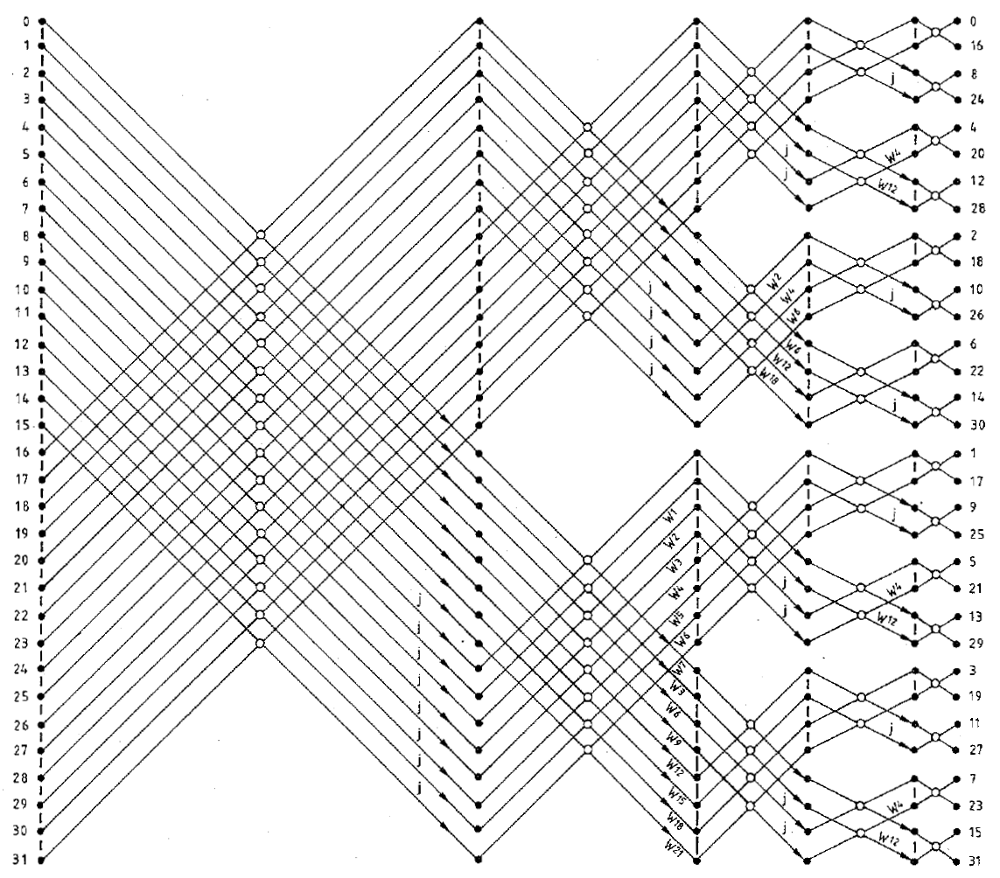
<figcaption>Fig.10 Flow Diagram of a 32-point split-radix algorithm <a href="#3">[3]</a> </figcaption>
</figure>

The full computation for DIF till the second-last stage involves L-shaped butterflies and in the last stage we need to apply some length-2 butterflies that doesn't involve any multiplication. This division is visualized in the image:

<figure>
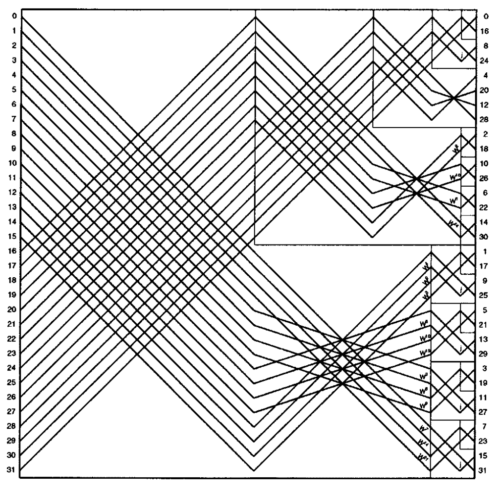
<figcaption>Fig.11 L shaped division in split radix algorithm <a href="#1">[1]</a> </figcaption>
</figure>

If the inputs are real valued, special optimized algorithms that make use of complex conjugate symmetries could be applied. A Decimation-In-Time version of the algorithm is favoured for this variation which has a vertically mirrored data flow graph as to what we see in (fig x). This version also requires the bit-order-reversed index sorting to be done in the beginning. The length-2 butterflies now has to be applied at the first stage and for the rest of stages L-shaped butterflies are applied.

The in-place algorithm makes use of complex-conjugate symmetry involved to optimally store real and imaginary part of intermediate complex values at different locations. This results in the final arrangement as follows:

The computing algoirthm for real-valued DIT split radix FFT makes use of special indexing to apply the different butterflies over different stages. The algorithm can be found in [[2]](#2)
C code for the FORTRAN algorithm for reference in [rsplitfft.c](https://github.com/dave18/Pandora-Star/blob/master/rsplitfft.c)

#### length-2 butterflies
The length-2 butterflies that we apply in the first stage are the most basic butterflies that do not involve any multiplication as shown in the figure. They also operate on consecutive data in memory and could be loaded and stored together to save cycles.

<figure>
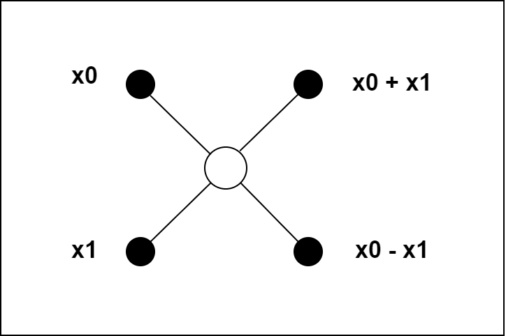
<figcaption>Fig.12 Basic length-2 butterfly</figcaption>
</figure>


#### l-shaped butterflies

The l-shaped butterflies operate on 4 inputs at a time and the indexing scheme we use points to the relevant data samples in each stage. The main operations here are addition, subtraction and multiplication by twiddle factors. Some special cases that are also considered while applying the butterfly to avoid un-necessary computations. One special case is when the twiddle factor is 1 and there is no multiplication involved. It could also be that it is a constant  $ (1/ \sqrt{2})- (j/ \sqrt{2})   $,  where we only need to multiply with the constant $(1/ \sqrt{2})$. This constant is coded into the instruction directly and used for multiplication. Both these cases, if applicable,  are handled at the beginning of every stage.

To deal with general-case butterflies, the twiddle factors for multiplication are pre-computed and stored as a Look-up Table in the order that they are required. When a twiddle factor, which is an exponential function, is decomposed into its constituent Cos and Sin components, the l-shaped butterfly computation loop requires four values namely, $cos(A)$, $sin(A)$, $cos(3*A)$ and $sin(3*A)$. The value of A is given by: $$ A = \frac{2\pi}{N2} $$,  where N2 starts at 2 and gets multiplied by 2 every stage. 

The twiddle factors are stored in the FDB-BS RAM that works like a normal Broadside RAM in general purpose mode. To make use of the 16KB space available fully, we store each two sets of these 4 values(4 Bytes each) in each page(32 Bytes) of FDB-BS RAM. The values are pre-computed and stored in exactly the order they are accessed using the reference C-code mentioned before. The auto-increment feature of BS-RAM increments the address by one-page everytime a read happens. Because of this, two set of twiddle factors in the current page are fetched together. The second set is stored in scratch-pad and is used in the next 'fetch cycle', when a new set of twiddle factors are required. A dedicated variable keeps track of the parity of the fetch cycle and loads 2 sets of twiddle factors every even cycle. This mechanism is explained in the figure below: 

<figure>
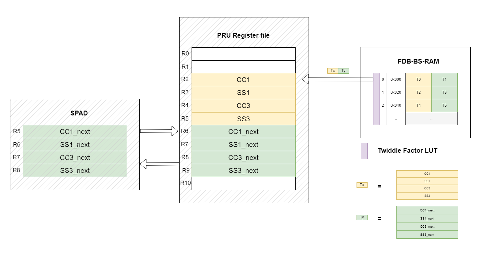
<figcaption>Fig.13 Alternate-cycle fetch of twiddle factors </figcaption>
</figure>

## References

<a id="1">[1]</a> 
D. Takahashi, "An extended split-radix FFT algorithm," in IEEE Signal Processing Letters, vol. 8, no. 5, pp. 145-147, May 2001, doi: 10.1109/97.917698.

<a id="2">[2]</a> 
H. Sorensen, D. Jones, M. Heideman and C. Burrus, "Real-valued fast Fourier transform algorithms," in IEEE Transactions on Acoustics, Speech, and Signal Processing, vol. 35, no. 6, pp. 849-863, June 1987, doi: 10.1109/TASSP.1987.1165220.

<a id="3">[3]</a> 
P. Duhamel, "Implementation of "Split-radix" FFT algorithms for complex, real, and real-symmetric data," in IEEE Transactions on Acoustics, Speech, and Signal Processing, vol. 34, no. 2, pp. 285-295


