

# PRU EMIF

## Introduction

This example demonstrates usage of PRU-ICSSG to emulate EMIF(Extended Memory Interface) client 16-bit/32-bit asynchronous parallel interface to interface with C2K F28379D.
The F283879D initiates requests for 16-bit or 32-bit reads/writes over EMIF1 & PRU_ICSSG respond to these requests.PRU firmware (PRUEMIF16) executing on AM243x
ICSSG PRU cores has been implemented to emulate the EMIF interface to repsond to 16 bit reads/writes. 
It also responds to 32 bit reads/writes by converting into two 16 bit read/writes request seperately. 

## Setup Details

### Hardware Requirements
The following hardware is used for testing :  
- AM243x EVM: [TMDS243GPEVM](https://www.ti.com/tool/TMDS243EVM)  
- AM243x High Speed Expansion board: [TMDS243DC01EVM](https://www.ti.com/tool/TMDS243DC01EVM)  
- F28379D controlCARD evaluation module: [TMDSCNCD28379D](https://www.ti.com/tool/TMDSCNCD28379D)  
- HSEC180 controlCARD Baseboard Docking Station: [TMDSHSECDOCK](https://www.ti.com/tool/TMDSHSECDOCK)  

### Software Requirements
#### C2000
C2000 software dependencies include:  
* [C2000Ware 4.02.00.00](https://www.ti.com/tool/download/C2000WARE/4.02.00.00)  
* [C2000 Code Generation Tools 22.6.1 LTS.](https://www.ti.com/tool/download/C2000-CGT/22.6.1.LTS)  

### Hardware Setup
#### TMDS243GPEVM & TMDS243DC01EVM Setup
Refer the following for AM243x EVM hardware setup & configuring HSEC expansion board for AM243x respectively

- [MCU_PLUS_SDK Getting Started Guide AM243x](https://software-dl.ti.com/mcu-plus-sdk/esd/AM243X/latest/exports/docs/api_guide_am243x/GETTING_STARTED.html)  
- [TMDS64DC01EVM User's Guide](https://www.ti.com/lit/ug/spruj06/spruj06.pdf?ts=1727259586031&ref_url=https%253A%252F%252Fwww.ti.com%252Ftool%252FTMDS243DC01EVM)  
    
  
####  TMDSCNCD28379D & TMDSHSECDOCK Setup
Refer the following for F28379D controlcard & HSEC180 Docking Station
- [TMS320F28379D controlCARD Information Guide](https://www.ti.com/lit/ug/sprui76b/sprui76b.pdf?ts=1727260498940&ref_url=https%253A%252F%252Fwww.google.com%252F)
- [HSEC180 controlCARD Baseboard Docking Station Guide](https://www.ti.com/lit/ug/spruij6a/spruij6a.pdf?ts=1727260545160&ref_url=https%253A%252F%252Fwww.google.com%252F)   
   

### Hardware Connection 
#### F28379D Jumper configuration

<table>
<tr>
    <th>Jumper
    <th>Connection
    <th>Configuration
</tr>

<tr>
    <td>J2
    <td>1-2</td>
    <td>Default Setting</td>
</tr>
<tr>
    <td>J3
    <td>1-2</td>
    <td>Default Setting</td>
</tr>
<tr>
    <td>J4
    <td>2-3</td>
    <td>Non Default Setting(MCU_GPIO-46_L -> HSEC_GPIO-46)</td>
</tr>
<tr>
    <td>J5
    <td>2-3</td>
    <td>Non Default Setting(MCU_GPIO-47_L -> HSEC_GPIO-47)</td>
</tr>
<tr>
    <td>J6
    <td>1-2</td>
    <td>Default Setting</td>
</tr>
<tr>
    <td>J7
    <td>1-2</td>
    <td>Default Setting</td>
</tr>

</table>

### Connections between TMDS243DC01EVM & TMDSHSECDOCK

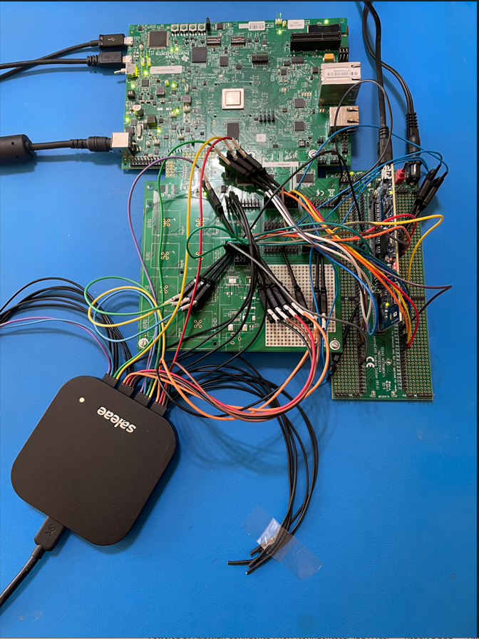

<table>
<tr>
    <th bgcolor=#232323>Net(AM243X)
    <th bgcolor=#232323>TMDS243DC01EVM PIN
    <th bgcolor=#242424>TMDSHSECDOCK PIN
    <th bgcolor=#242424 >GPIO PIN(F28379D)
    <th bgcolor=#262626> EMIF Signal
    <th bgcolor=#262626> GPyGMUXn.GPIOz 
    <th bgcolor=#262626> GPyMUXn.GPIOzs
    <th bgcolor=#252525>Logic Analyzer Channel
</tr>
<tr>
        <td>PRG0_PRU0GPO8</td>
        <td>J2.17</td>
        <td>94</td>
        <td>GPIO46</td>
        <td>EM1A6</td>
        <td>00b</td>
        <td>10b</td>
        <td>11 </td>
    </tr>
    <tr>
        <td>PRG0_PRU0GPO2</td>
        <td>J2.5</td>
        <td>124</td>
        <td>GPIO38</td>
        <td>EM1A0</td>
        <td>00b</td>
        <td>10b</td>
        <td>5 </td>
    </tr>
    <tr>
        <td>PRG0_PRU0GPO3</td>
        <td>J2.7</td>
        <td>88</td>
        <td>GPIO39</td>
        <td>EM1A1</td>
        <td>00b</td>
        <td>10b</td>
        <td>6 </td>
    </tr>
    <tr>
        <td>PRG0_PRU1GPO1</td>
        <td>J4.7</td>
        <td>150</td>
        <td>GPIO83</td>
        <td>EM1D1</td>
        <td>00b</td>
        <td>10b</td>
        <td>13 </td>
    </tr>
    <tr>
        <td>PRG0_PRU1GPO0</td>
        <td>J4.5</td>
        <td>152</td>
        <td>GPIO85</td>
        <td>EM1D0</td>
        <td>00b</td>
        <td>10b</td>
        <td>12 </td>
    </tr>
    <tr>
        <td>PRG0_PRU0GPO4</td>
        <td>J2.9</td>
        <td>89</td>
        <td>GPIO40</td>
        <td>EM1A2</td>
        <td>00b</td>
        <td>10b</td>
        <td>7 </td>
    </tr>
    <tr>
        <td>PRG0_PRU1GPO16</td>
        <td>J5.11</td>
        <td>86</td>
        <td>GPIO34</td>
        <td>EM1CS[2]</td>
        <td>00b</td>
        <td>10b</td>
        <td>0 </td>
    </tr>
    <tr>
        <td>PRG0_PRU1GPO8</td>
        <td>J4.19</td>
        <td>143</td>
        <td>GPIO76</td>
        <td>EM1D8</td>
        <td>00b</td>
        <td>10b</td>
        <td> </td>
    </tr>
    <tr>
        <td>PRG0_PRU0GPO7</td>
        <td>J2.15</td>
        <td>92</td>
        <td>GPIO45</td>
        <td>EM1A5</td>
        <td>00b</td>
        <td>10b</td>
        <td>10 </td>
    </tr>
    <tr>
        <td>PRG0_PRU0GPO17</td>
        <td>J3.11</td>
        <td>82</td>
        <td>GPIO31</td>
        <td>EM1WE</td>
        <td>00b</td>
        <td>10b</td>
        <td>1 </td>
    </tr>
    <tr>
        <td>PRG0_PRU0GPO18</td>
        <td>J4.1</td>
        <td>123</td>
        <td>GPIO37</td>
        <td>EM1OE</td>
        <td>00b</td>
        <td>10b</td>
        <td>2 </td>
    </tr>
    <tr>
        <td>PRG0_PRU0GPO19</td>
        <td>J4.3</td>
        <td>86</td>
        <td>GPIO34</td>
        <td>EM1CS[2]</td>
        <td>00b</td>
        <td>10b</td>
        <td> </td>
    </tr>
    <tr>
        <td>PRG0_PRU0GPO0</td>
        <td>J2.1</td>
        <td>GND</td>
        <td></td>
        <td></td>
        <td></td>
        <td></td>
        <td> </td>
    </tr>
    <tr>
        <td>PRG0_PRU1GPO4</td>
        <td>J4.13</td>
        <td>147</td>
        <td>GPIO80</td>
        <td>EM1D4</td>
        <td>00b</td>
        <td>10b</td>
        <td> </td>
    </tr>
    <tr>
        <td>PRG0_PRU1GPO12</td>
        <td>J5.3</td>
        <td>139</td>
        <td>GPIO72</td>
        <td>EM1D12</td>
        <td>00b</td>
        <td>10b</td>
        <td> </td>
    </tr>
    <tr>
        <td>PRG0_PRU0GPO5</td>
        <td>J2.11</td>
        <td>91</td>
        <td>GPIO41</td>
        <td>EM1A3</td>
        <td>00b</td>
        <td>10b</td>
        <td>8 </td>
    </tr>
    <tr>
        <td>PRG0_PRU1GPO3</td>
        <td>J4.11</td>
        <td>148</td>
        <td>GPIO81</td>
        <td>EM1D3</td>
        <td>00b</td>
        <td>10b</td>
        <td> </td>
    </tr>
    <tr>
        <td>PRG0_PRU1GPO15</td>
        <td>J5.9</td>
        <td>122</td>
        <td>GPIO36</td>
        <td>EM1WAIT </td>
        <td>00b</td>
        <td>10b</td>
        <td>3 </td>
    </tr>
    <tr>
        <td>PRG0_PRU1GPO13</td>
        <td>J5.5</td>
        <td>82</td>
        <td>GPIO31</td>
        <td>EM1WE   </td>
        <td>00b</td>
        <td>10b</td>
        <td> </td>
    </tr>
    <tr>
        <td>PRG0_PRU1GPO5</td>
        <td>J4.15</td>
        <td>146</td>
        <td>GPIO79</td>
        <td>EM1D5</td>
        <td>00b</td>
        <td>10b</td>
        <td> </td>
    </tr>
    <tr>
        <td>PRG0_PRU0GPO6</td>
        <td>J2.13</td>
        <td>90</td>
        <td>GPIO44</td>
        <td>EM1A4</td>
        <td>00b</td>
        <td>10b</td>
        <td>9 </td>
    </tr>
    <tr>
        <td>PRG0_PRU1GPO2</td>
        <td>J4.9</td>
        <td>149</td>
        <td>GPIO82</td>
        <td>EM1D2</td>
        <td>00b</td>
        <td>10b</td>
        <td> </td>
    </tr>
    <tr>
        <td>PRG0_PRU1GPO11</td>
        <td>J5.1</td>
        <td>140</td>
        <td>GPIO73</td>
        <td>EM1D11</td>
        <td>00b</td>
        <td>10b</td>
        <td> </td>
    </tr>
    <tr>
        <td>PRG0_PRU0GPO1</td>
        <td>J2.3</td>
        <td>161</td>
        <td>GPIO92</td>
        <td>EM1BA[1]</td>
        <td>00b</td>
        <td>11b</td>
        <td>4 </td>
    </tr>
    <tr>
        <td>PRG0_PRU1GPO6</td>
        <td>J4.17</td>
        <td>145</td>
        <td>GPIO78</td>
        <td>EM1D6</td>
        <td>00b</td>
        <td>10b</td>
        <td> </td>
    </tr>
     <tr>
        <td>PRG0_PRU1GPO14</td>
        <td>J5.7</td>
        <td>123</td>
        <td>GPIO37</td>
        <td>EM1OE   </td>
        <td>00b</td>
        <td>10b</td>
        <td> </td>
    </tr>
</table>

    Add a common ground between TMDSHSECDOCK  & TMDS243DC01EVM

### PRU Pin Usage

##### Proposed PRU Pin Out
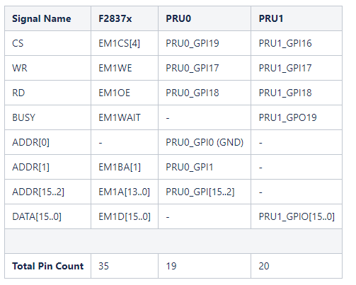

PRU EMIF16 was developed and tested using the reduced number of PRU pins available on the
TMDS243DC01EVM. Specifically:
 - EMIF address: 9-bit byte address bus formed as
    - EM1A[6…0]:EM1BA[1]:0 = PRU0_GPI[8…2]:PRU0_GPI[1]:PRU0_GPI[0],
    - PRU0_GPI[0]=GND(Ground).
 - EMIF data:
    - 13-bit data bus formed as EM1D[12…0] = PRU1_GPIO[12…0]

 - Unconnected (missing) data bits within 13-bit data bus:
     - EM1D[7] = PRU1_GPIO[7]
     - EM1D[9] = PRU1_GPIO[9]
     - EM1D[10] = PRU1_GPIO[10]
***
#### PRU0 GPIO Pin Connections to EMIF Signals

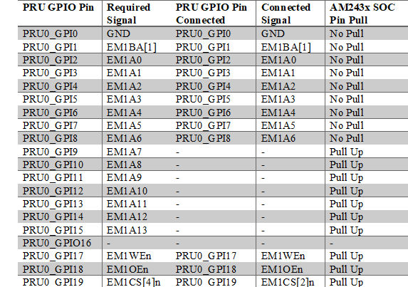
***
#### PRU1 GPIO Pin Connections to EMIF Signals

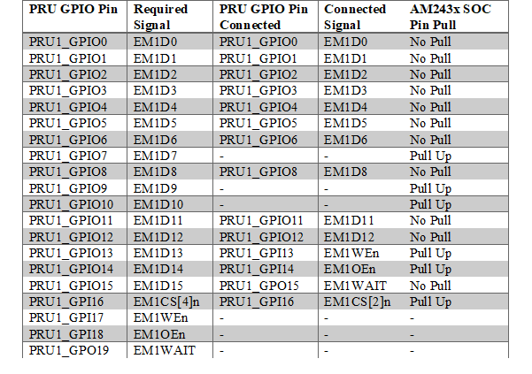
***
NOTE
~~~
The PRU firmware address and data bus connections can be modified by updating the macros in
these files:
 - ${open-pru}\\examples\\pru_emif\\ pruemif16\firmware\\include\\pruemif16_cfg.inc : Address bus number of bits
 - ${open-pru}\\examples\\pru_emif\\pruemif16\\firmware\\pru0\\pruemif16_emif_addr_cfg.inc:
     - Address bus least significant bit PRU pin number
     - Control signal (CSn(Chip Select), WEn(Write Enable), OE(Read/Output Enable)) PRU pin numbers
 - ${open-pru}\\examples\\pru_emif\\pruemif16\\firmware\\pru1\\pruemif16_emif_data_cfg.inc:
     -  Data bus least significnat bit PRU pin number
     - Data bus number of bits
     - Control signal PRU pin numbers
     - Starting address of SMEM buffer
~~~

### Software Setup
#### AM243x EVM
The MCU PLUS SDK[Getting Started"](https://software-dl.ti.com/mcu-plus-sdk/esd/AM243X/10_00_00_20/exports/docs/api_guide_am243x/GETTING_STARTED.html)
documentation provides instructions on software installation and setup. 

Install [PRU Code Generation Tools 2.3.3](https://www.ti.com/tool/download/PRU-CGT/2.3.3) at C:/ti location for building the pru firmware
#### F28379D
 The [C2000Ware Quick Start Guide](https://www.ti.com/lit/SPRUIV6) provides instructions on C2000Ware installation and setup.
 In-depth C2000Ware documentation is located in the [C2000Ware software guide](https://software-dl.ti.com/C2000/docs/software_guide/intro.html)

## Project Directory Structure 
<table>
<tr>
    <th>Folder/Files
    <th>Description
</tr>
<tr><td colspan="2"> ${open-pru}/examples/pru_emif/pruemif16</td></tr>
<tr>
    <td>am243x_pru_emif16
    <td>AM243X R5F Application</td>
</tr>
<tr>
    <td>emif_ex1_16bit_asram.c</td>
    <td>F28379D Test Application Source File </td>
</tr>
<tr>
    <td>emif_asram_pin_setup.c</td>
    <td>F28379D Test Application Setup File </td>
</tr>
<tr>
    <td>firmware/pru0
    <td>Firmware project for PRU0</td>
</tr>
<tr>
    <td>firmware/pru1
    <td>Firmware project for PRU1</td>
</tr>

</table>

## Build Steps 
Import the AM243x Test Application from the path mentioned in the project directory.  

Import the F28379D Test Application project from ${C2000ware_path}\driverlib\f2837xd\examples\cpu1\emif\CCS path.Replace Source file &
Setup file from pruemif16 project directory. 

You can build the projects after a successfull export. 

Pre-built PRU0 & PRU1 FW(firmware) images are contained in C header files located in:
 ${open-pru}examples/pru_io/pru_emif/pruemif16/am243x_pru_emif16/firmware
 
These C header files are compiled into the R5F application, and there is no need to rebuild the PRU
firmware unless the firmware is modified.

However The PRU EMIF16 firmware code can be modified and rebuilt if desired. The PRU0 and PRU1 firmware
images are built separately.
To build the firmware import the firmware project from the project directory and build them seperately for PRU0 & PRU1. 

## Target Configuration 

You need to set a advanced target configuration to connect to two targets(AM243X & F28379D) simultaneously.  
Please follow the steps below :   
- Go to view -> Target Configuration
- Right Click -> New Target Configuration 
- Create a new target configuration with desired file name (i.e XDS100v2_XDS100.ccxml)
- Go to Advanced target configuration 
     - 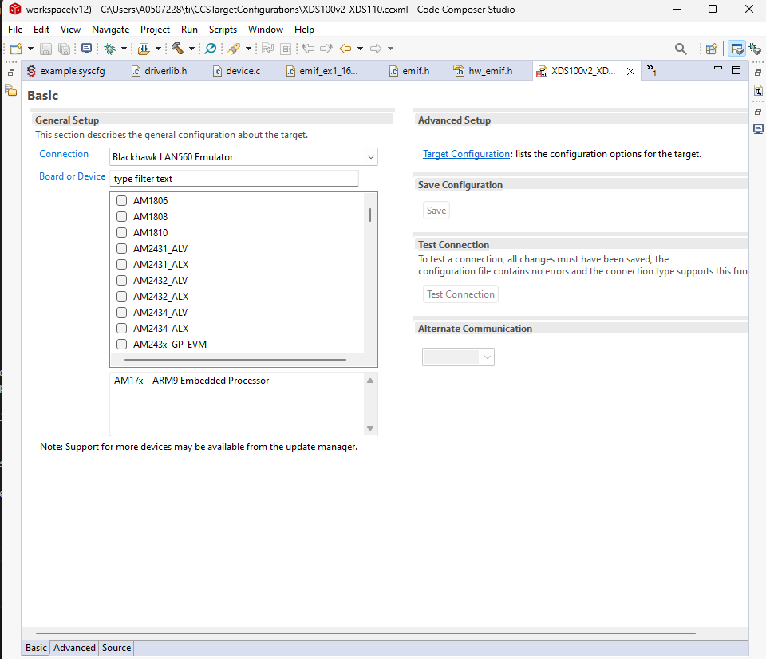
- Initiate two new connections 
     - XDS100v2 Debug Probe
     - XDS110 USB Debug Probe 
- Add components to the connections 
     - TMS32028379D
     - AM243x_GP_EVM
- Target Configuration should look like this 
      - 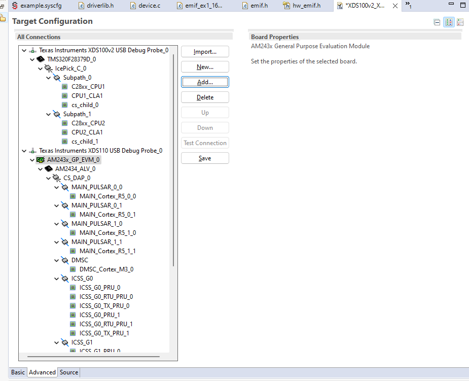
- Save the configuration 

## Debug

Launch a CCS debug session and run the executable, see Getting Started/CCS Launch at this [page] (https://dev.ti.com/tirex/explore/node?node=A__AD2nw6Uu4txAz2eqZdShBg__com.ti.MCU_PLUS_SDK_AM243X__AROnekL__LATEST)

## R5F Host Software

Host R5F software is used to initialize PRU-ICSSG, initialize PRU0 and PRU1, download the
PRU FW(Firmware), and start FW execution. The R5F application uses MCU+SDK drivers to configure
PRU-ICSSG. The block diagram below shows the software layers. After FW execution
begins, there is no communication between the R5F and PRU cores.
- 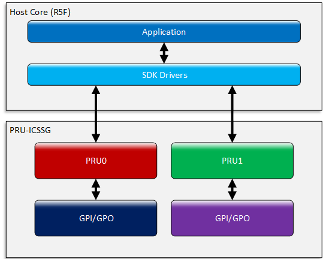

### R5F Application, SysConfig Usage

The R5F application uses SysConfig to configure ICSSG. First, an ICSSG configuration instance
is added in SysConfig. Next, the following parameters are configured:
- Select ICSSG Instance, set to ICSSG0 (note ICSSG1 could also be selected).
- Select PRU core clock frequency, set to 333 MHz. This maximizes the PRU cycles
  available for processing EMIF transactions.
- Add and configure PRU0 and PRU1 GPIO pins:
     - Control pins: select PRU_GPI, Rx active, Pull Up
     - Address pins: select PRU_GPI, Rx active, No Pull
     - Data pins: select PRU_GPO, Rx active, No Pull

### R5F Application, PRU-ICSS Driver Usage
The R5F application also uses MCU+SDK PRUICSS driver API functions to configure ICSSG.
Driver API functions are used to configure ICSSG as follows:
- Initialize (clear) IMEM0/1, DMEM0/1 and SMEM.
- Set ICSSG GP mux mode to GP (vs ENDAT, MII, or SD) mode.
- Set SA mux mode to default (vs ENDAT) mode.
- Set GPI mode to Direct input (vs 16-bit parallel capture, etc.).
Driver API functions are also used to configure PRU0 and PRU1 as follows:
- Download FW images
- Reset FW initialization flag. The FW images share this flag with each other to indicate
  initialization is complete.

## PRU Firmware

The PRU0 FW latches the EMIF address and shares it with PRU1. ICSSG SPAD(Scratchpad Memory) is used for
sharing the address with PRU1. The FW only needs to share a single address per EMIF read or
write cycle, so only a single 16-bit SPAD memory location is used for sharing the address. A
flag in SPAD indicates the status of the shared address: logic 0 indicates the address has not been
shared and logic 1 indicates the address has been shared. PRU0 can write logic 1 to the SPAD
sharing flag, but not logic 0. Similarly, PRU1 can write logic 0 to the SPAD sharing flag, but not
logic 1. An error is generated if PRU0 FW is ready to share the address, but the flag is already
set to logic 1. A diagram depicting the EMIF address sharing scheme is presented below.

- 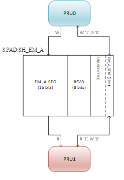

A 32-bit read/write access from the F2837xD generates two back-to-back 16-bit read/write
accesses, where the EMIF CS pin is held low for the duration of both 16-bit accesses. The PRU
FW images check for this and properly handle the second 16-bit access in a 32-bit access.

### PRU0 (Address) Firmware

The figures below are program flow diagrams for the PRU0 FW

***
PRU0 Firmware Top Level Program Flow

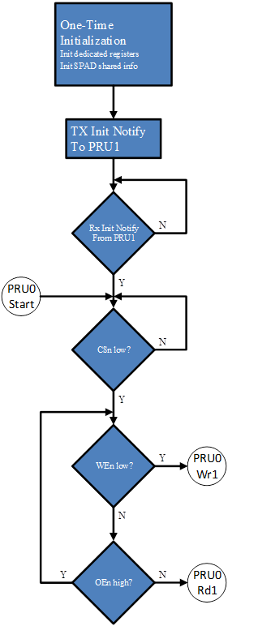

***
PRU0 Firmware EMIF Read Progarm Flow

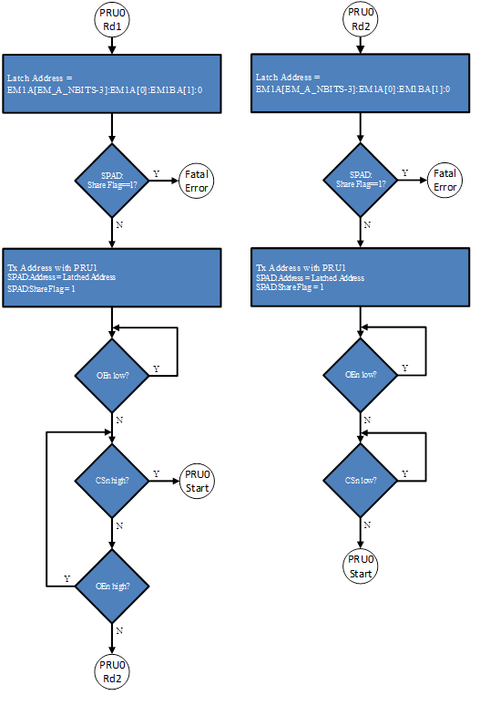

***
PRU0 Firmware EMIF Write Program Flow

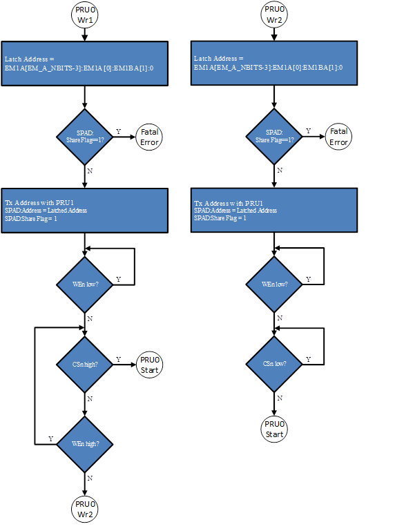

### PRU1 (Data) Firmware

    DPM stands for Dual port Memory and in this case it is ICSSG0_SMEM

The PRU1 FW uses the address shared by PRU0 to access the DPM(Dual Port Memory) at the addressed location.
For a write access, the data value on the data bus is written to the DPM. For a read access, the
data value read from the DPM is driven on the data bus.
PRU1 FW allocates the DPM into ICSSG SMEM. However, the DPM memory buffer could be
placed in any SOC memory.
The FW uses the ICSSG Fast GPIO feature (see AM64x/AM243x TRM) to quickly switch the
data bus between Input (in case of write) and Output (in case of read). The data bus is configured
by default as Input to avoid bus contention with the F2837xD. When an EMIF read cycle is
initiated, the FW switches the data bus to Output. At the end of the read cycle, the data bus is
switched back to Input.
PRU1 FW drives the EMIF WAIT signal:
- EMIF write: WAIT asserted after WEn low is detected, de-asserted after data value
latched from data bus written to DPM.
- EMIF read: WAIT asserted after OEn low detected, de-asserted after data value read
from DPM driven on data bus.
The figures below are program flow diagrams for the PRU1 FW.

***
PRU1 Firmware Top Level Program Flow 

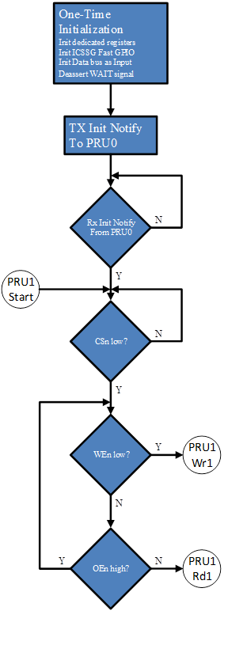

***
PRU1 Firmware EMIF Read Progarm Flow  

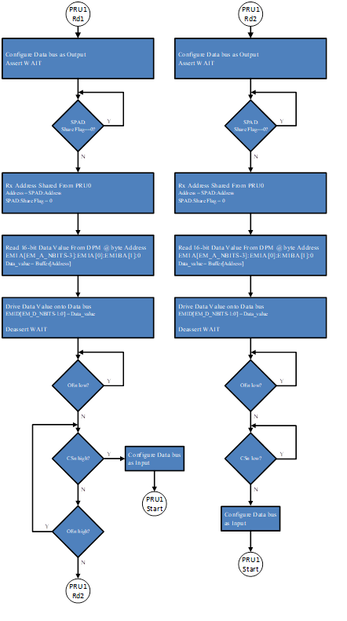

***
PRU1 Firmware EMIF Write Program Flow  

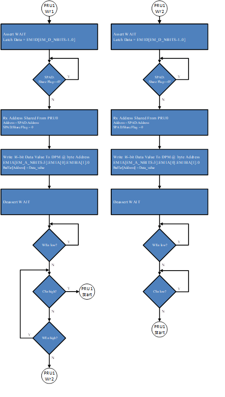

## Testing 
### EMIF Read/Write Tests 

<table>
<tr><th>Test ID</th><th>Name</th><th>Description</th><th>Test Results</th><th>Notes</th></tr>
<tr><td>0</td><td>n Read 16-bit, SOB</td><td>F283879D read n 16-bit words from AM243x DPM. Read toward start of DPM buffer.</td><td>PASS</td><td>n=8</td></tr>
<tr><td>1</td><td>n Read 16-bit, EOB</td><td>F283879D read n 16-bit words from AM243x DPM. Read toward end of DPM buffer.</td><td>PAS</td><td>n=8</td></tr>
<tr><td>2</td><td>n Write 16-bit, SOB</td><td>F283879D write n 16-bit words to AM243x DPM. Write toward start of DPM buffer.</td><td>PASS</td><td>n=8</td></tr>
<tr><td>3</td><td>n Write 16-bit, EOB</td><td>F283879D write n 16-bit words to AM243x DPM. Write toward end of DPM buffer.</td><td>PASS</td><td>n=8</td></tr>
<tr><td>4</td><td>n Read-Write 16-bit,SOB</td><td>F283879D read-write n 16-bit words from/to AM243x DPM. Read immediately before write in loop. Read/write toward start of DPM buffer.    </td><td>PASS</td><td>n=8</td></tr>
<tr><td>5</td><td>n Read-Write 16-bit, EOB</td><td>F283879D read-write n 16-bit words from/to AM243x DPM.  Read immediately before write in loop. Read/write toward end of DPM buffer.</td><td>PASS</td><td>n=8</td></tr>
<tr><td>6</td><td>n Write-Read Back 16-bit, SOB</td><td>F283879D write-read back n 16-bit words to/from AM243x DPM. Write immediately before read in loop. Write/read toward start of DPM buffer.</td><td>PASS</td><td>n=8</td></tr>
<tr><td>7</td><td>n Write-Read Back 16-bit, EOB</td><td>F283879D write-read back n 16-bit words to/from AM243x DPM. Write immediately before read in loop. Write/read toward end of DPM buffer.</td><td>PASS</td><td>n=8</td></tr>
<tr><td>8</td><td>n Read 32-bit, SOB</td><td>F283879D read n 32-bit words from AM243x DPM. Read toward start of DPM buffer.</td><td>PASS	</td><td>n=4</td></tr>
<tr><td>9</td><td>n Read 32-bit, EOB</td><td>F283879D read n 32-bit words from AM243x DPM. Read toward end of DPM buffer.</td><td>PASS</td><td>n=4</td></tr>
<tr><td>10</td><td>n Write 32-bit, SOB</td><td>F283879D write n 32-bit words to AM243x DPM. Write toward start of DPM buffer.</td><td>PASS</td><td>n=4</td></tr>
<tr><td>11</td><td>n Write 32-bit, EOB</td><td>F283879D write n 32-bit words to AM243x DPM. Write toward start of DPM buffer.</td><td>PASS</td><td>n=4</td></tr>
<tr><td>12</td><td>n Read-Write 32-bit, SOB</td><td>F283879D read-write n 32-bit words from/to AM243x DPM. Read immediately before write in loop. Read/write toward start of DPM buffer.</td><td>PASS</td><td>n=4</td></tr>
<tr><td>13</td><td>n Read-Write 32-bit, EOB</td><td>F283879D read-write n 16-bit words from/to AM243x DPM. Read immediately before write in loop. Read/write toward end of DPM buffer.</td><td>PASS</td><td>n=4</td></tr>
<tr><td>14</td><td>n Write-Read Back 32-bit, SOB</td><td>F283879D write-read back n 32-bit words to/from AM243x DPM. Write immediately before read in loop. Write/read toward start of DPM buffer.</td><td>PASS</td><td>n=4</td></tr>
<tr><td>15</td><td>n Write-Read Back 32-bit, EOB</td><td>F283879D write-read back n 32-bit words to/from AM243x DPM. Write immediately before read in loop. Write/read toward end of DPM buffer.</td><td>PASS</td><td>n=4</td></tr>
<tr><td>16</td><td>n Read 16-bit, Write 32-bit, Read, SOB</td><td>F283879D read n 16-bit, write n 32-bit words to/from AM243x DPM. Read immediately before write in loop. Read/write toward start of DPM buffer.</td><td>PASS</td><td>n=4</td></tr>
<tr><td>17</td><td>n Read 16-bit, Write 32-bit, Read, EOB</td><td>F283879D read n 16-bit, write n 32-bit words to/from AM243x DPM. Read immediately before write in loop. Read/write toward end of DPM buffer.</td><td>PASS</td><td>n=4</td></tr>
<tr><td>18</td><td>n Read 32-bit, Write 16-bit, Read, SOB</td><td>F283879D read n 32-bit, write n 16-bit words to/from AM243x DPM. Read immediately before write in loop. Read/write toward start of DPM buffer.</td><td>PASS</td><td>n=4</td></tr>
<tr><td>19</td><td>n Read 32-bit, Write 16-bit, Read, EOB</td><td>F283879D read n 32-bit, write n 16-bit words to/from AM243x DPM. Read immediately before write in loop. Read/write toward end of DPM buffer.</td><td>PASS</td><td>n=4</td></tr>
<tr><td>20</td><td>n Write 16-bit Read Back 32-bit, SOB</td><td>F283879D write n 16-bit, read back n/2 32-bit words to/from AM243x DPM. Write immediately before read in loop. Write/read toward start of DPM buffer.</td><td>PASS</td><td>n=8</td></tr>
<tr><td>21</td><td>n Write 16-bit Read Back 32-bit, EOB</td><td>F283879D write n 16-bit, read back n/2 32-bit words to/from AM243x DPM. Write immediately before read in loop. Write/read toward end of DPM buffer.</td><td>PASS</td><td>n=8</td></tr>
<tr><td>22</td><td>n Write 32-bit Read Back 16-bit, SOB</td><td>F283879D write n/2 32-bit, read back n 16-bit words to/from AM243x DPM. Write immediately before read in loop. Write/read toward start of DPM buffer.</td><td>PASS</td><td>n=8</td></tr>
<tr><td>23</td><td>n Write 32-bit Read Back 16-bit, EOB</td><td>F283879D write n/2 32-bit, read back n 16-bit words to/from AM243x DPM. Write immediately before read in loop. Write/read toward end of DPM buffer.</td><td>PASS</td><td>n=8</td></tr>

