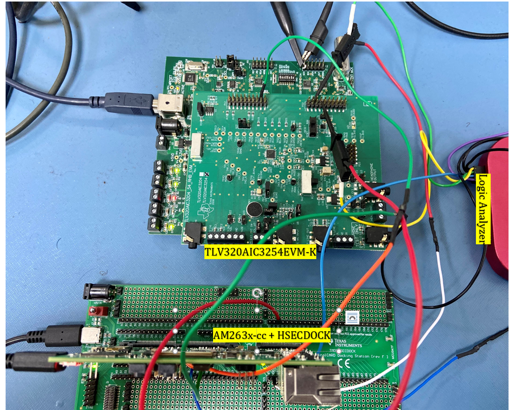
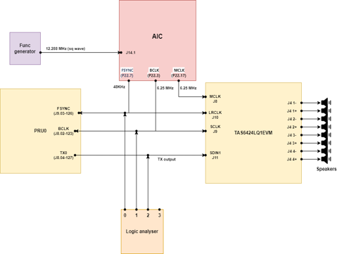
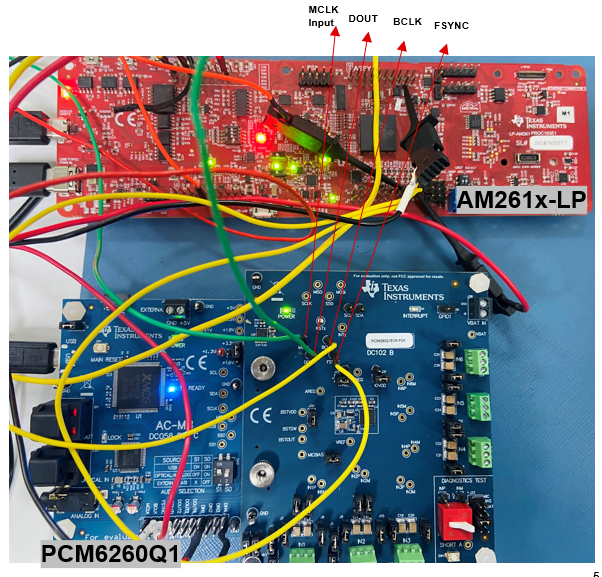
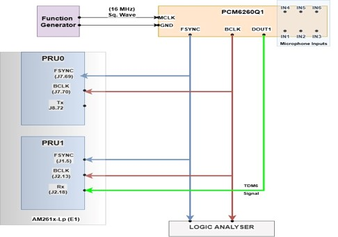
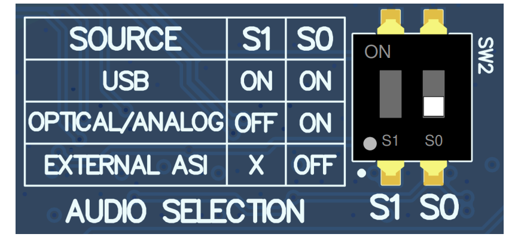
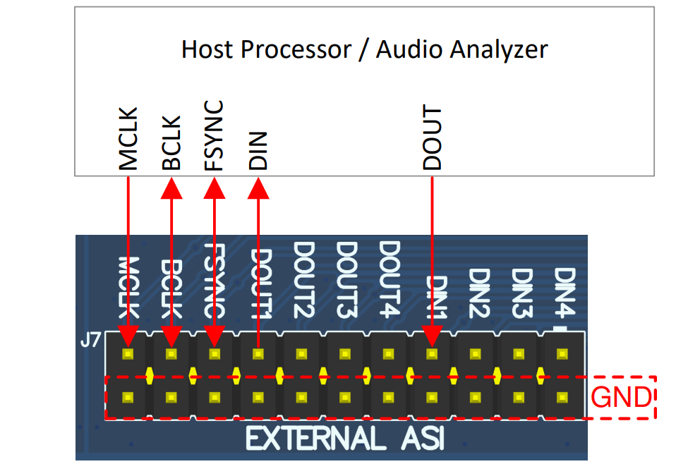
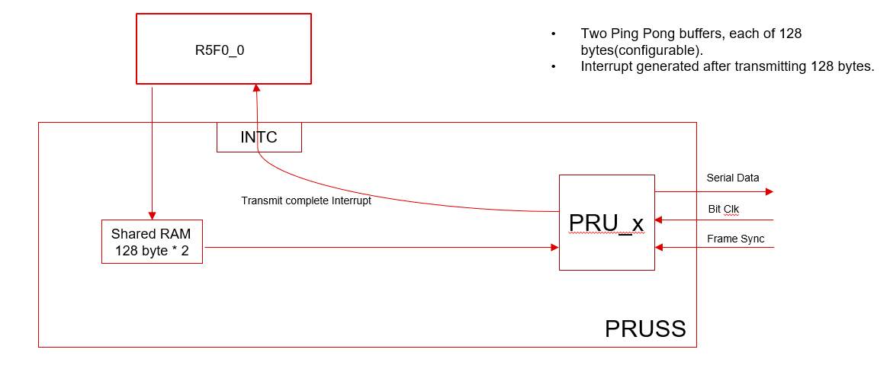
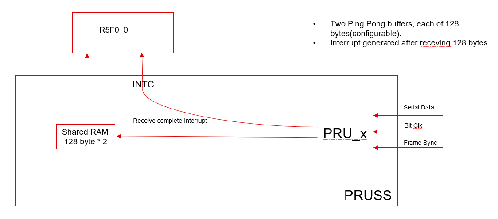
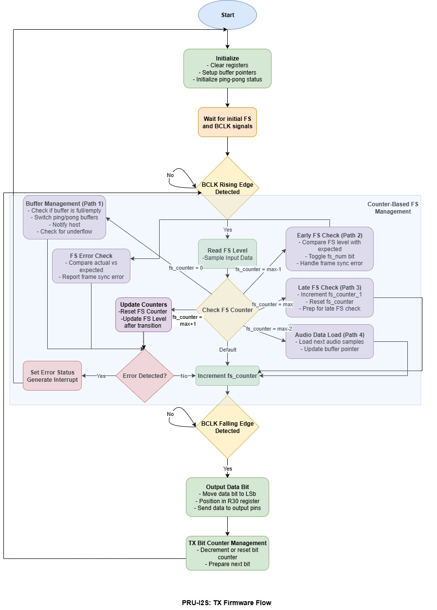
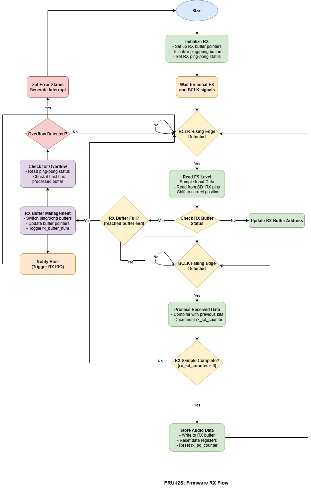

# PRU-I2S/TDM

## Introduction

This example demonstrates the usage of PRU-ICSS to implement an I2S (Inter-IC Sound) and TDM (time division multiplexing) interface on the AM263x/AM261x processors. The PRU-ICSS subsystem is utilized to emulate an I2S/TDM master, allowing for transmission and reception of audio data over the PRU-I2S interface. The PRU firmware, executing on 2 PRU cores (PRU0 for Tx and PRU1 for Rx), has been implemented to handle audio data streams from the external sources and generate standard I2S/TDM data streams which is in sync with external clock audio clocks (BCLK, FSYNC). The I2S interface uses two Ping Pong buffers, each 128 bytes (configurable), for RX and TX.

- RX: Interrupt generated after receiving 128 bytes, Buffer 0 and Buffer 1 used in a Ping Pong fashion.
- TX: Interrupt generated after transmitting 128 bytes, Buffer 0 and Buffer 1 used in a Ping Pong fashion.

This double buffering technique ensures continuous and efficient data transmission and reception with minimal latency and overhead.
## Setup Details

### Hardware Requirements
#### AM263xCC
The following hardware is used for testing :  
-	AM263x Control Card (CC) [TMDSCNCD263](https://www.ti.com/tool/TMDSCNCD263)
-	TMDSHSECDOCK HSEC180 control card Baseboard Docking Station [HSECDOCK](https://www.ti.com/tool/TMDSHSECDOCK)
-	CC & HSECDOC Power Supply
-	If using HSECDOCK 5V power: 5V, 3A PSU
-	If directly supplying power to AM263x CC: USB Type-C AC/DC Supply, 5V/3A
-	AIC EVM[TLV320AIC3254EVM-K](https://www.ti.com/tool/TLV320AIC3254EVM-K)
-	Function generator 
-	logic analyzer
#### AM261xLP
The following hardware is used for testing :
-	AM261x-LP E1 [LP-AM261](https://www.ti.com/tool/LP-AM261) 
-	5V power: 5V, 3A PSU
-	PCM6260-Q1EVM [PCM6260-Q1](https://www.ti.com/product/PCM6260-Q1)
-	Function generator 
-	logic analyzer

### Software Requirements
-	Code Composer Studio 12.81
-	Sysconfig 1.23.1
-	mcu_plus_sdk_am263x
-   mcu_plus_sdk_am261x
-	PUREPATHCONSOLE Application software & framework | TI.com
-	AIC3254 [SLAC349](https://www.ti.com/tool/download/SLAC349)
-   PCM6260Q1 APP [PCM6260QEVM-SW](https://www.ti.com/secureresources/PCM6260QEVM-SW)

### Hardware Connection 

#### Connections between AM263xCC & TLV320AIC3254EVM-K Setup

##### Block Diagram

#####	Connect AM263x CC to HSECDOC
-	AM263x CC 120 Pin Primary Card-Edge  HSECDOCK J3A
-	AM263x CC 60 Pin Secondary Card-Edge  HSECDOCK J3B
#####	Connect AIC3254:
-	Connect PC over a USB cable to USB connector J7.
-	Set SW2.1,3,6,7 ON.
-	For external audio interface, SW2.4,5 OFF.
-	Function generator MCLK → AIC J14.1 MCLK.
-	Connect PRU I2S clocks as follows:
-	AIC P22.3 BCLK → PRU I2S BCLK (J8.02-123)
-	AIC P22.7 WCLK → PRU I2S FSYNC (J9.03-126)

#### Connections between AM261xLP & PCM6260-Q1 

##### Block Diagram
BD_AM261x.jpg
##### Connect AM261xLP to PCM6260-Q1 
-	Connect PC over a USB cable to USB connector.
-	Set SW2 as shown in figure below for External ASI mode
 
-	Provide MCLK as 16MHz from function generator to MCLK pin in J7 on PCM6260
 
-	Connect PRU I2S clocks as follows:
-	J7 BCLK → PRU I2S BCLK (J2.13)
-	J7 FSYNC → PRU I2S FSYNC (J1.5)
-	J7 DOUT1 → PRU I2S RX (J2.18)
-	Open PCM6260 GUI

> **_NOTE:_** We can use TLV320AIC3254EVM-K also for generating external clock source for PRU. 

### PRU Pin Usage
#### AM263xCC
<table border="1" cellpadding="5" cellspacing="0">
  <tr>
    <th>PRU Core</th>
    <th>PRU I2S Signal</th>
    <th>PRU GPIO</th>
    <th>I/O</th>
    <th>HSECDOCK</th>
  </tr>
  <tr>
    <td>0</td>
    <td>BCLK</td>
    <td>PR0_PRU0_GPIO6</td>
    <td>INPUT</td>
    <td>J8.02-123</td>
  </tr>
  <tr>
    <td>0</td>
    <td>FSYNC</td>
    <td>PR0_PRU0_GPIO1</td>
    <td>INPUT</td>
    <td>J9.03-126</td>
  </tr>
  <tr>
    <td>0</td>
    <td>TX</td>
    <td>PR0_PRU0_GPIO2</td>
    <td>OUTPUT</td>
    <td>J8.04-127</td>
  </tr>
  <tr>
    <td>1</td>
    <td>BCLK</td>
    <td>PR0_PRU1_GPIO0</td>
    <td>INPUT</td>
    <td>J8.11-143</td>
  </tr>
  <tr>
    <td>1</td>
    <td>FSYNC</td>
    <td>PR0_PRU1_GPIO1</td>
    <td>INPUT</td>
    <td>J9.11-144</td>
  </tr>
  <tr>
    <td>1</td>
    <td>RX</td>
    <td>PR0_PRU1_GPIO2</td>
    <td>INPUT</td>
    <td>J8.12-145</td>
  </tr>
</table>

#### AM261xLP-E1
<table border="1" cellpadding="5" cellspacing="0">
  <tr>
    <th>PRU Core</th>
    <th>PRU I2S Signal</th>
    <th>PRU GPIO</th>
    <th>I/O</th>
    <th>AM261x Header No.</th>
  </tr>
  <tr>
    <td>0</td>
    <td>BCLK</td>
    <td>PR1_PRU0_GPIO5</td>
    <td>INPUT</td>
    <td>J7.70</td>
  </tr>
  <tr>
    <td>0</td>
    <td>FSYNC</td>
    <td>PR1_PRU0_GPIO6</td>
    <td>INPUT</td>
    <td>J7.69</td>
  </tr>
  <tr>
    <td>0</td>
    <td>TX</td>
    <td>PR1_PRU0_GPIO7</td>
    <td>OUTPUT</td>
    <td>J8.72</td>
  </tr>
  <tr>
    <td>1</td>
    <td>BCLK</td>
    <td>PR1_PRU1_GPIO5</td>
    <td>INPUT</td>
    <td>J2.13</td>
  </tr>
  <tr>
    <td>1</td>
    <td>FSYNC</td>
    <td>PR1_PRU1_GPIO9</td>
    <td>INPUT</td>
    <td>J1.5</td>
  </tr>
  <tr>
    <td>1</td>
    <td>RX</td>
    <td>PR1_PRU1_GPIO12</td>
    <td>INPUT</td>
    <td>J2.18</td>
  </tr>
</table>

## R5F Host Software

Host R5F software is used to initialize PRU-ICSSG, initialize PRU0 and PRU1, download the
PRU FW(Firmware), and start FW execution. The R5F application uses MCU+SDK drivers to configure
PRU-ICSSG. The block diagram below shows the software layers. After FW execution
begins, there is no communication between the R5F and PRU cores.

### R5F Application, SysConfig Usage

The R5F application uses SysConfig to configure ICSSM. First, an ICSSM configuration instance is added in SysConfig. Next, the following parameters are configured:

- Select ICSSM Instance, set to ICSSM1 (note ICSSM0 could also be selected).
- Select PRU core clock frequency, set to 333 MHz. This maximizes the PRU cycles available for I2S audio processing.
- Add and configure PRU0 and PRU1 GPIO pins:
  - PRU0 I2S pins:
    - BCLK (PR1_PRU0_GPIO5): select PRU_GPI, Rx active, Pull Down
    - FSYNC (PR1_PRU0_GPIO6): select PRU_GPI, Rx active, Pull Down
    - TX (PR1_PRU0_GPIO7): select PRU_GPO, Tx active, No Pull
  - PRU1 I2S pins:
    - BCLK (PR1_PRU1_GPIO5): select PRU_GPI, Rx active, Pull Down
    - FSYNC (PR1_PRU1_GPIO9): select PRU_GPI, Rx active, Pull Down
    - RX (PR1_PRU1_GPIO12): select PRU_GPI, Rx active, No Pull

### R5F Application, PRU-ICSS Driver Usage
The R5F application also uses MCU+SDK PRU I2S driver API functions to configure and operate the ICSSM.
Driver API functions are used to configure ICSSM as follows:
- Initialize the PRU I2S driver using "PRUI2S_init()" which reads firmware configuration from PRU0/1 and updates the driver configuration table.
- Get PRU I2S attributes with "PRUI2S_getInitCfg()" to retrieve configuration details including buffer sizes, sampling frequency, and slot width.
- Set default parameters with "PRUI2S_paramsInit()" before opening PRU I2S instances.
- Open PRU I2S instances with "PRUI2S_open()" which clears ICSS IMEM/DMEM, initializes ICSS INTC, downloads firmware, and registers interrupt callbacks.
- Configure GPIO pins for I2S signals (BCLK, FSYNC, TX, RX) using "PRUI2S_pruGpioPadConfig()".
- Set up ping/pong buffer mechanisms with "PRUI2S_initPpBufs()" to enable continuous audio streaming.

Driver API functions are also used to configure PRU0 and PRU1 interrupts:
- Configure system event to channel mapping with "PRUICSS_intcSetSysEvtChMap()".
- Enable/disable PRU I2S interrupts using "PRUI2S_enableInt()" and "PRUI2S_disableInt()".
- Set up interrupt handlers for TX and RX operations that post to semaphores when buffers are ready.
- Clear interrupts with "PRUI2S_clearInt()" as shown in the interrupt service routines.
## PRU Firmware
### Overview
The PRU I2S firmware implements I2S and TDM audio interfaces using the Programmable Real-Time Units of AM263x/AM261x processors, leveraging deterministic timing for precise audio signal handling.

### Architecture
- PRU0: Manages transmit (TX) operations
- 
- PRU1: Handles receive (RX) operations
- 
### Key Features
- I2S and TDM protocol support
- Ping-Pong buffering (dual 128-byte buffers)
- Interrupt-driven operation
- External clock synchronization (BCLK, FSYNC)
- Configurable audio parameters
### Memory Layout
- PRU_IMEM: Instruction memory (16kB)
- PRU_DMEM: Data memory for ping-pong buffers
- PRU_SHAREDMEM: 64kB shared memory for communication
### GPIO Configuration
#### PRU0 (Transmit)
- 
- BCLK: Input (bit clock)
- FSYNC: Input (frame sync)
- TX: Output (audio data)
#### PRU1 (Receive)
- 
- BCLK: Input (bit clock)
- FSYNC: Input (frame sync)
- RX: Input (audio data)

### Interrupt Handling
Interrupts trigger when:

- TX buffer completes transmission
- RX buffer is filled
- Errors occur
### Communication
- Memory-mapped registers for configuration
- System events for interrupt signaling
- Shared memory for buffer exchange
### Error Detection
- Buffer underruns/overruns
- Clock and frame sync errors
### Deployment
- R5F loads firmware to PRU memory
- R5F configures GPIO pins and interrupts
- PRUs process I2S signals per configuration
This implementation provides a high-performance I2S interface that offloads audio processing while maintaining the precise timing required for digital audio applications.
## Testing 
